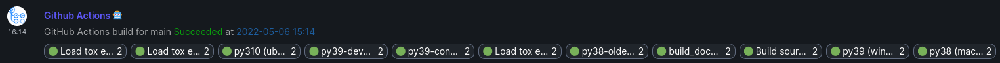

Notify Matrix about Completion of a GitHub Action Workflow
==========================================================

This action sends a message into a matrix room saying if a workflow succeeds or
fails, and also sends reactions for each of the jobs with their status.

Put this action at the end of your workflow so it looks like this:

```yaml
jobs:
  pass:
    runs-on: ubuntu-latest
    steps:
      - run: exit 0

  fail:
    runs-on: ubuntu-latest
    steps:
      - run: exit 1

  notify:
    if: always()
    runs-on: ubuntu-latest
    needs: [pass, fail]
    steps:
      - uses: Cadair/matrix-notify-action@main
        id: message
        with:
          matrix_token: ${{ secrets.matrix_access_token }}
          github_token: ${{ secrets.GITHUB_TOKEN }}
          homeserver: 'https://matrix.org'
          roomid: '!alsdkjaslkdakldjas:matrix.org'

      - name: Print the event ID
        run: echo "Sent Matrix Event '${{ steps.message.outputs.eventId }}'"
```

When the action is run, it collects all the completed jobs in the workflow and
uses those to compute the status of the workflow and send the reactions for the
individual jobs.

The result is something which looks like this:




Other Configuration Options
---------------------------

If you do not wish to post reactions for all of the jobs executed by the
workflow you can specify a regular expression which is an ignore pattern,
matched against the name.
To enable this add something similar to the following to the `with:` block


```yaml
ignore_pattern: '.*long.*'
```
